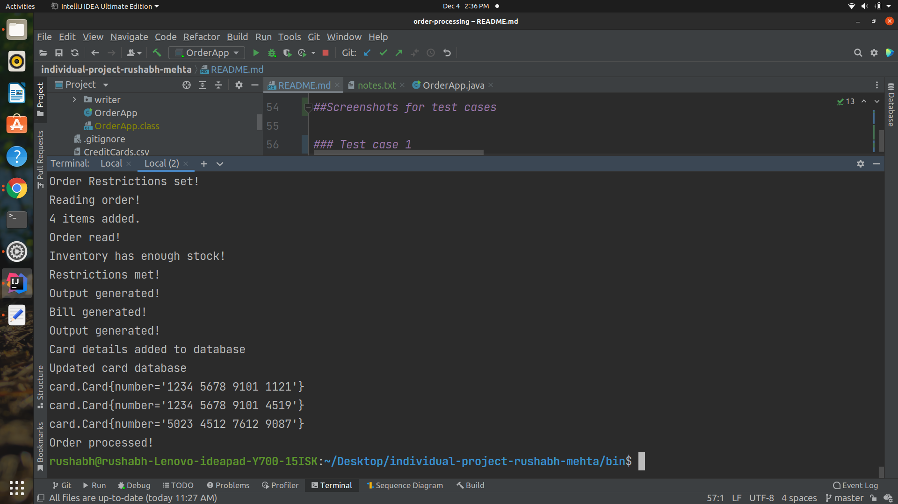
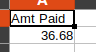
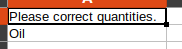
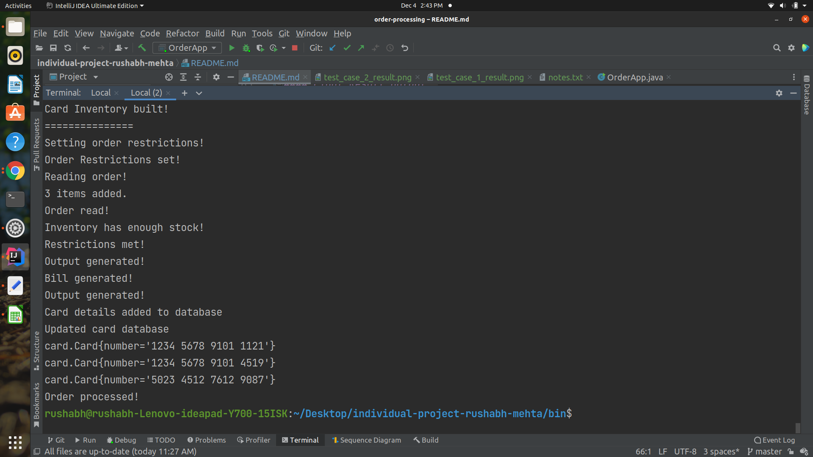
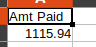

## Installations
Need to have java 8 installed

## Instructions to Build the Program

### Compile the program
At the root level (i.e. in the /individual-project-rushabh-mehta directory run the following command to compile the program) 
`javac -d bin -sourcepath src src/OrderApp.java`

### Run the program with commandline arguments
Make sure you are in /individual-project-rushabh-mehta directory
Then run the following commands to run the program  
`cd bin`  
`java OrderApp <path to item database csv> <path to card database csv> <path to order item csv> <path to result csv>`  
Note: Specify all paths to all the csv files as absolute paths
## Design Patterns Used
I decided to use the following design patterns to model the application:
1. State
2. Builder
3. Singleton
4. Iterator

### Rationale for State Design Pattern
As per the problem statement, there are many steps that the order goes through before the bill is generated.
Therefore, I chose the state pattern where the different states of an order are:
1. INIT: The initialization state, when a new order object is created.
2. READ: The order enters this state when the order details are read from the csv file.
3. DBVALIDATED: The order enters this state when the items and their quantities in the order are validated against their presence in the inventory.
4. RESTRICTIONVALIDATED: The order enters this state after it is DBVALIDATED and the items in the order are within the cap specified by the different item categories(Luxury, Essentials, Misc).
5. BILLGENERATED: Once the order enters this state, it indicates that the order has satisified all the constraints and then the bill total for the order is calculated.
6. CARDDETAILSSAVED: Once the bill total is calculated, the card used for making the payment is checked against the card database and if the card details do not exist in the card database they are added into the database.
7. ORDERPROCESSED: This is the final state, an order enters this state if everything was processed correctly at the above stages and no error was found at any stage.
8. INVALID: An order can enter this state from any state, when some error occurs. Examples of error include the item inventory does not have enough items to satisfy the order, or the order exceeds the cap of the item categories.
### Rationale for Builder Design Pattern
I used the builder design pattern multiple times in the application to build complex objects.
Places where builder design pattern was used are:
1. To build the item inventory:
   1. Building an item inventory can be a complex task which can be broken down into:
      1. Reading the data from the input data file.
      2. Creating objects of the Item class for each item.
      3. The finally building the item inventory.
   2. Since building an item inventory is a multi step process, a builder design pattern can be used to abstract away the implementation details from the user. The user can set the file path from where to read the data and call the build() method to build the item inventory.
2. To build the card inventory.
3. To build the OrderRestriction object in which the user can set restrictions for multiple categories of items.

### Rationale for Singleton Design Pattern
Since there is only one common ItemInventory for all orders, it makes sense to make the ItemInventory a singleton.
Same logic applies for the CardInventory (used to store the details of the cards).

### Rationale for Iterator Design Pattern
The iterator pattern is used to while parsing the dataset file to create a item inventory and card inventory. It abstracts away the location from where the data is being read and allows the location to change from a file to a database (in the future) with minimal code refactoring.
## Class Diagram

##Screenshots for test cases

### Test case 1
#### Card Intermediate Output

#### Final Result Output

### Test case 2
#### Final Result Output

### Test case 3
#### Card Intermediate Output

#### Final Result Output
